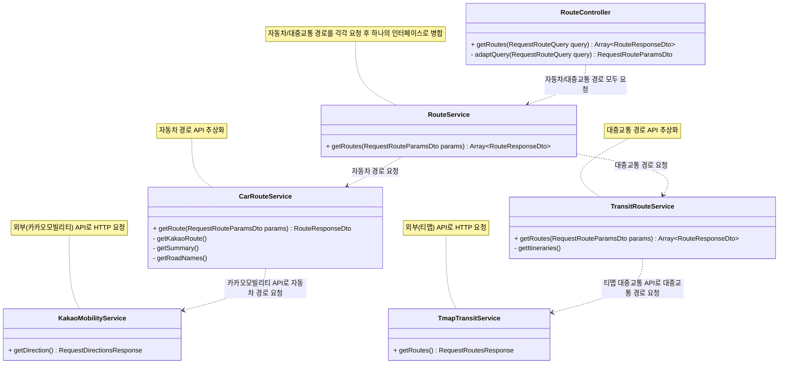

# 경로 탐색 API

## Sample

`Request`

```bash
curl --location --request GET 'http://localhost:30183/routes?originLatitude=37.6134436427887&originLongitude=126.926493082645&destinationLatitude=37.5004198786564&destinationLongitude=127.126936754911'
```

`Response`

```json
[
  {
    "type": "car",
    "duration": 2968,
    "distance": 33657,
    "name": "통일로71길",
    "routeNames": [
      "통일로71길",
      "진흥로",
      "평창문화로",
      "정릉로",
      "내부순환로",
      "동부간선도로(성수장암간)",
      "강변북로",
      "동부간선도로(청담장지간)",
      "양재대로",
      "송파대로",
      "중대로"
    ]
  },
  {
    "type": "bus",
    "name": "동명여고.천주교불광동성당",
    "duration": 4674,
    "distance": 28276,
    "routeNames": ["간선:741"]
  },
  {
    "type": "subway",
    "name": "불광",
    "duration": 5946,
    "distance": 38272,
    "routeNames": ["수도권6호선"]
  }
]
```

## Diagram


